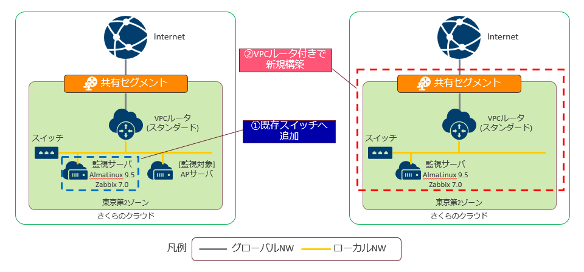

# [Deproying Sample] さくらのクラウドでterraform - プライベート監視サーバ構築

## 構成イメージ図


## Deployment Summary
ZabbixサーバをベースにさくらのクラウドIaaS上に監視サーバをデプロイするコードです。

設定フラグを切り替える事で既存のスイッチ環境へのデプロイ、VPCルータを含めた新規環境としてのデプロイに対応します。

## Versions confirmed to work

|tools||
|---|---|
|terraform|1.9.3|
|openssh|1.8.9|

|terraform-providers||
|---|---|
|sacloud/sakuracloud|2.23.0|
|hashicorp/local|2.5.1|
|hashicorp/null|3.2.2|
|hashicorp/template|2.2.0|


|OS/MW||
|---|---|
|AlmaLinux|9.4(cloud-img)|
|PostgreSQL|13.3|
|Zabbix|7.0.2(LTS)|

## 利用する手順

1. コードをcloneで取得、本コードのフォルダへ移動します。
~~~
git clone https://github.com/tskaz/sakura_tf.git
cd 01_zabbix-server
~~~

2. 作成したい環境に合わせ、 variables.tf ファイルを編集します。
~~~
vi variables.tf
~~~

* サーバのrootユーザ/作業用ユーザのsacloud-userのPWは初期値を指定していません。 [var.password] 変数で指定する事も可能ですが特に指定しない場合は terraform plan/apply時に入力してください。
~~~
variable "password" {
  nullable = false
}
~~~


* sw_already_exisits の値を変更する事で構成図① or ②を切り替えできます。

~~~
variable "sw_already_exisits" {
  default = false
}
~~~

  * sw_already_exisits:trueの場合は①の構成になり、指定されたスイッチの配下に監視サーバを構築します。 
    * GWやNWアドレス等、既存スイッチに対応したNW設定を指定してください。
    * ※構築時のパッケージ取得のため、指定したGW以降でインターネット環境へ接続できる必要があります。

```
### If sw_already_exisits is true
variable "existing_sw" {
  default = {
    sw_id = "" # 既存スイッチのリソースコードを指定
    nw = "192.168.100.0/24"
    gw = "192.168.100.254"
    netmask = "24"
  }
}
```

* sw_already_exisits:falseの場合は②の構成になり、VPCルータ/スイッチを含めて監視サーバを構築します。
  * 新規スイッチ、VPCルータが作成されるため必要なNW関連の設定値を指定してください。

~~~
### If sw_already_exisits is false ###
variable "new_sw" {
  default = {
    nw = "192.168.1.0/24"
    gw = "192.168.1.1"
    netmask = "24"
  }
}

variable "vpcrt" {
  default = {
    plan = "standard" # スタンダードのみ/プレミアム以上の場合はコード修正が必要です
    prv_nw = "192.168.1.0/24"
    prv_hostip = 1
    netmask = "24"
    pf_zabbix_pub = "8080"
    pf_zabbix_prv = "8080"
    pf_ssh_pub = "10022"
    pf_ssh_prv = "22"
  }
}
~~~


3. terraformを init/plan/apply の順で実行します。
password変数に初期値を指定しない場合はplan/applyの際に入力してください。
~~~
terraform init
terraform plan
terraform apply

var.password
  Enter a value: #PWを入力後Enter
~~~

4. 構築後のoutputを確認します。

* 構成①(sw_already_exisits:true) の場合
  * 既存スイッチNW内のIPがアサインされた状態でサーバが作成されます。
  * サーバへssh接続する場合は、ユーザ[sacloud-user]、PJフォルダ内に生成される[id_rsa_zbx01]ファイルを使用して公開鍵認証でSSH接続してください。
  * sacloud-userはsudoersへ登録済のため、sudoコマンドを使って特権ユーザとしてサーバ操作可能です。 
  * zabbixのwebフロントエンドへ接続する場合はzabbix_url_prvのアドレスへアクセスしてください。
~~~
Outputs:

server_info = {
  "hostname" = [
    "sakuracloud-dev-zabbix-zbx01",
  ]
  "ip_address" = [
    "192.168.100.100",
  ]
  "os" = "AlmaLinux 9.4 (cloudimg)"
  "ssh_cmd_example_prv" = "ssh sacloud-user@192.168.100.100 -i [ssh_key]"
  "ssh_cmd_example_pub" = ""
}
vpcrt_info = {
  "vpcrt_ip" = []
}
zabbix_url = {
  "zabbix_url_prv" = "http://192.168.100.100:8080"
  "zabbix_url_pub" = ""
~~~

* 構成②(sw_already_exisits:false) の場合
  * サーバ関連の設定、操作は構成①と同様です。
  * 新規VPCルータ配下にzabbixサーバが作成されます。
  * VPCルータにポートフォワード設定をしているため、zabbixサーバに対して以下の通り転送されます。 VPCルータのグローバルIPへアクセスする事で外部からzabbixサーバへアクセスできます。
    * ssh(10022→22)
    * web(8080→8080)
~~~
Outputs:

server_info = {
  "hostname" = [
    "sakuracloud-dev-zabbix-zbx01",
  ]
  "ip_address" = [
    "192.168.1.100",
  ]
  "os" = "AlmaLinux 9.4 (cloudimg)"
  "ssh_cmd_example_prv" = "ssh sacloud-user@192.168.1.100 -i [ssh_key]"
  "ssh_cmd_example_pub" = "ssh sacloud-user@[VPCルータのグローバルIP] -p 10022 -i [ssh_key]"
}
vpcrt_info = {
  "vpcrt_ip" = [
    "[VPCルータのグローバルIP]",
  ]
}
zabbix_url = {
  "zabbix_url_prv" = "http://192.168.1.100:8080"
  "zabbix_url_pub" = "http://[VPCルータのグローバルIP]:8080"
}
~~~

5. zabbix初期設定/ログイン
zabbix_urlへログイン後、以下を参考に初期設定を実施してください。
https://www.zabbix.com/documentation/7.0/en/manual/installation/frontend

* ようこそ画面
  * 日本語パッケージインストール済のため、デフォルトの言語は[日本語(ja_JP)]を選択可能です。
* 前提条件のチェック
  * 必要パッケージはインストール済のため次ステップへ進めてください。
* データベース接続設定
  * データベースはPostgreSQLインストール済です。以下の通り設定してください。※記載以外は初期値で構いません。
    * データベースホスト：[localhost]
    * データベースユーザのPW：[zabbix]
* 設定画面
  * Zabbixサーバ名に任意の名称を入力してください。
  * タイムゾーンは[(UTC+09:00)Asia/Tokyo]を選択してください。

初期設定後は以下の認証情報(Zabbix初期値)でログインできます。
監視環境に応じてZabbix内の設定を進めてください。
* ユーザー名：Admin
* パスワード：zabbix

※参考：Zabbix Quickstart
https://www.zabbix.com/documentation/7.0/en/manual/quickstart/login

6. 環境の削除

destroyコマンドで削除します。
password変数の入力を求められる場合は任意の値(構築時と同じでなくてもOK)を入力してください。
```
terraform destroy
```
